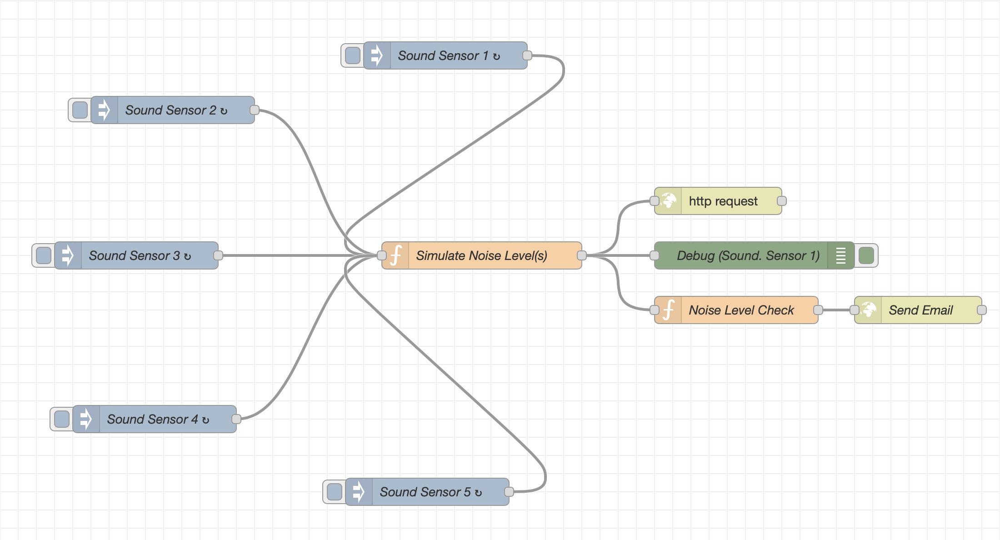
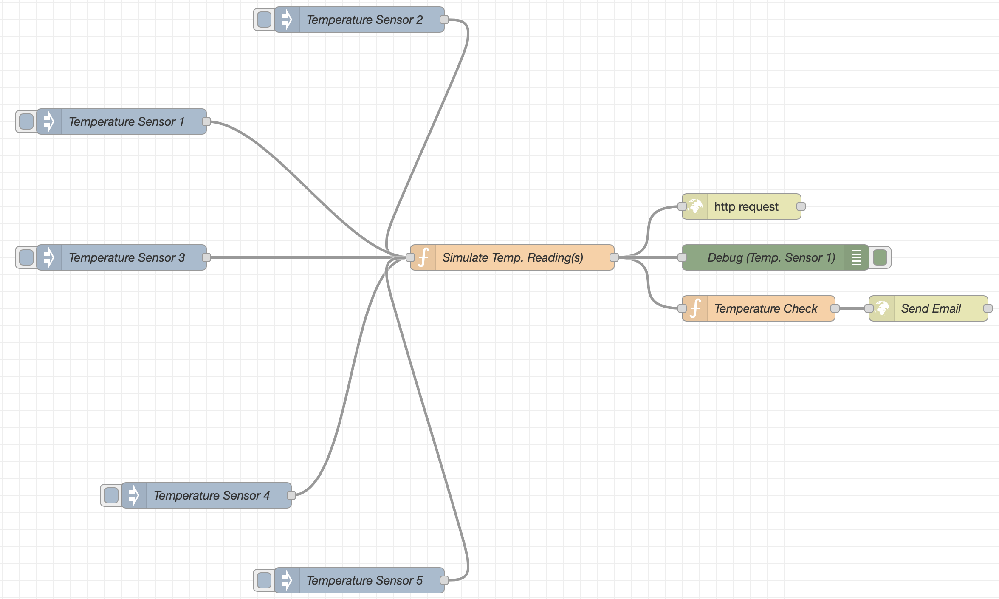

# Forest Project

This project is designed to help notify relevant authorities and concerned communities of ongoing logging activities or forest fires. 
The system uses a basic Python backend built with Flask to handle HTTP requests, sending notifications and emails using the Nylas APIs, based on detected events.

## Table of Contents

- [Installation](#installation)
- [Usage](#usage)
- [Project Structure](#project-structure)
- [Endpoints](#endpoints)
- [Future Enhancements](#future-enhancements)
- [Contributing](#contributing)
- [License](#license)

## Installation

### Prerequisites

- Python 3.x installed on your machine.
- `pip` (Python package installer).

### Steps

1. **Clone the repository:**

   ```bash
   git clone https://github.com/your-username/ForestWatch.git
   cd ForestWatch
   ```

2. **Create a virtual environment (optional but recommended):**

   ```bash
   python -m venv .venv
   source .venv/bin/activate  # On Windows use `.venv\Scripts\activate`
   ```

3. **Install the required packages:**

   ```bash
   pip3 install Flask
   ```

4. **Run the application:**

   ```bash
   python app.py
   ```

   The application will be running at `http://127.0.0.1:5000/`.

## Usage

### Testing the Endpoints

- **Home Page:**

  Visit the home page by navigating to `http://127.0.0.1:5000/` in your web browser. You should see a welcome message.

- **Notify Endpoint:**

  You can test the `/notify` endpoint using a tool like Postman or cURL:

  ```bash
  curl -X POST -H "Content-Type: application/json" -d '{"event":"logging"}' http://127.0.0.1:5000/notify
  ```

  This will simulate a logging event, and you'll receive a JSON response confirming the event.

## Project Structure

```
forest-project/
│
├── app.py          # Main Flask application
└── README.md       # Project documentation
```

## Endpoints

- `GET /` - Returns a welcome message.
- `POST /notify` - Handles event notifications. Accepts JSON data with an `event` field.

  Example JSON request:
  ```json
  {
    "event": "logging"
  }
  ```

## Acoustic Sensors Simulation


## Temperature Sensors Simulation


## Future Enhancements

- **Integrate with Nylas API:** Add functionality to send detailed email notifications using the Nylas API.
- **Add Real Event Detection:** Implement real-time detection of logging and fire events using IoT devices or external APIs.
- **Deploy to Cloud:** Host the Flask application on a cloud platform like Heroku or AWS.

## Contributing

Contributions are welcome! Please fork the repository and create a pull request with your proposed changes.

## License

This project is licensed under the MIT License. See the [LICENSE](LICENSE) file for details.
